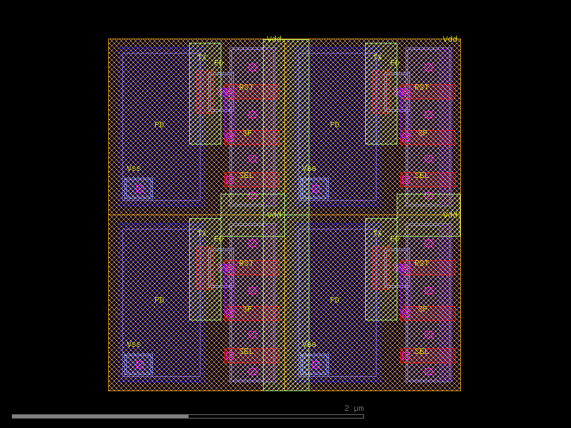

# Editing &amp; DRC

Beyond drawing from scratch, klayout-draw-mcp can **open an existing layout, edit it,
inspect it, and run simple design-rule checks**. The typical loop is:

```
load_gds → inspect_gds → (edit) → drc_check → save_gds
```

These tools were added in [0.1.1](https://pypi.org/project/klayout-draw-mcp/0.1.1/).

## Loading an existing layout

`load_gds` reads a GDS/OASIS file into the in-memory session, replacing any current
layout. After loading you keep using the normal drawing tools (`add_box`,
`add_polygon`, …) to modify it, then `save_gds` to write it back.

```
load_gds("chip.gds")                      # first top cell
load_gds("chip.gds", top_cell="PIXEL")    # a specific cell
```

```text
Loaded chip.gds: top_cell='CIS_APS', dbu=0.001 um, 2 cells, 10 layers. Ready to edit.
```

## Inspecting

`inspect_gds` reports, per layer, the shape count, **merged** area (so overlaps are not
double-counted) and bounding box, plus the cell list. With a `path` it inspects a file
without touching the session; without one it inspects the current session.

```
inspect_gds("chip.gds")
```

```text
top_cell='CIS_APS', dbu=0.001 um, cells=2
bbox: (0,0;2,2) um
cells: ['APS_PIXEL', 'CIS_APS']

layer       shapes    area[um^2]   bbox[um]
2/0              4        4.0000   (0,0)-(2,2)
3/0             16        2.4192   (0.08,0.06)-(1.94,1.94)
4/0              8        1.0416   (0.57,0.05)-(1.95,1.95)
6/0             16        0.3936   (0.5,0.16)-(1.97,1.82)
9/0             12        0.3200   (0.62,0.06)-(1.95,1.94)
10/0             4        1.8000   (0.05,0.05)-(1.55,1.95)
```

## Simple DRC

`drc_check` runs a list of rules against a file (`path`) or the current session and
reports, per rule, **PASS/FAIL with violation counts and locations**. Distances are in
micrometers; `datatype` defaults to `0`.

### Rule types

| `type` | Parameters | Meaning |
| --- | --- | --- |
| `spacing` | `layer`, `min` | Minimum space between shapes **within** one layer |
| `width` | `layer`, `min` | Minimum feature width on a layer |
| `overlap` | `layer`, `layer2` | **Forbidden** overlap — any intersection of two layers is a violation |
| `separation` | `layer`, `layer2`, `min` | Minimum space **between** two layers |
| `enclosure` | `layer`, `layer2`, `min` | `layer2` must surround `layer` by at least `min` |

### Example

```json
[
  {"type": "spacing",    "layer": 3, "datatype": 0, "min": 0.15},
  {"type": "width",      "layer": 6, "datatype": 0, "min": 0.08},
  {"type": "overlap",    "layer": 3, "layer2": 6},
  {"type": "separation", "layer": 3, "layer2": 10, "min": 0.05},
  {"type": "enclosure",  "layer": 3, "layer2": 10, "min": 0.02}
]
```

```text
DRC: 5 rules, 3 failing
spacing 3/0 >= 0.15um: FAIL (8 violations)  at (0.550,0.692), (1.010,0.500), (1.820,1.000), (0.820,1.000)
width 6/0 >= 0.08um: PASS
forbidden overlap 3/0 & 6/0: FAIL (20 regions, 0.2784 um^2)  at (0.820,0.200), (1.820,0.200), (0.820,0.440), (1.820,0.440)
separation 3/0 <-> 10/0 >= 0.05um: FAIL (4 violations)  at (0.565,0.700), (1.565,0.700), (0.565,1.700), (1.565,1.700)
enclosure 10/0 of 3/0 >= 0.02um: PASS
```

`max_report` (default 10) caps the number of locations listed per rule.

Those locations can be drawn back as marker boxes to see exactly where the violations
are. Here the OD spacing violations on the CIS pixel are highlighted on a marker layer:

{ loading=lazy width=560 }

!!! tip
    The violation locations are centre points (in µm), so an assistant can read them
    back, decide what to move, edit with the drawing tools, and re-run `drc_check` —
    a closed correction loop.
