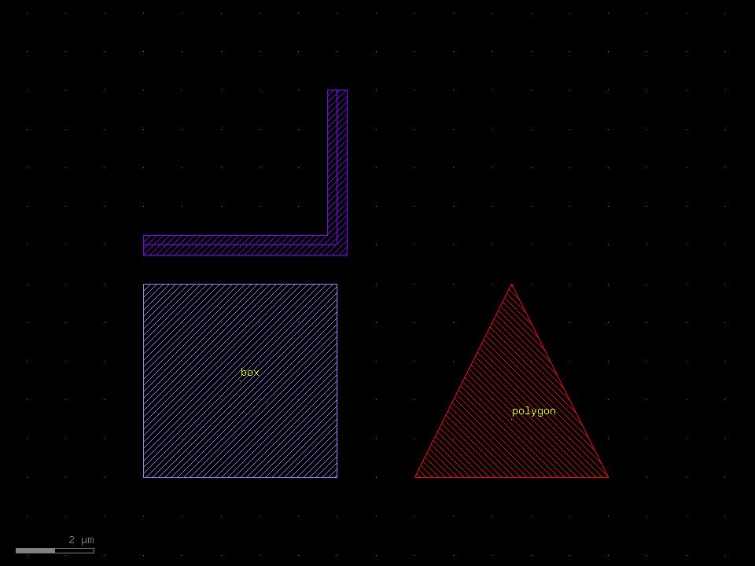
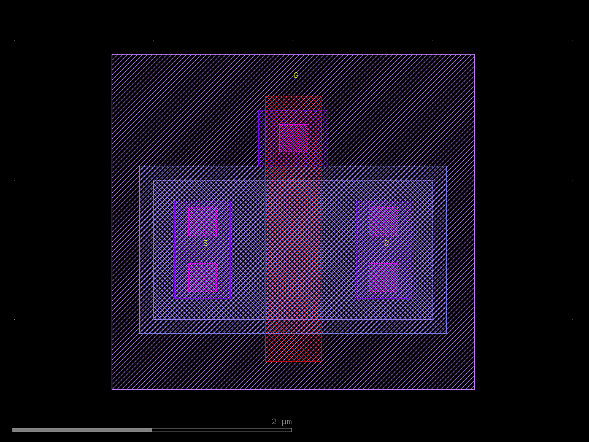
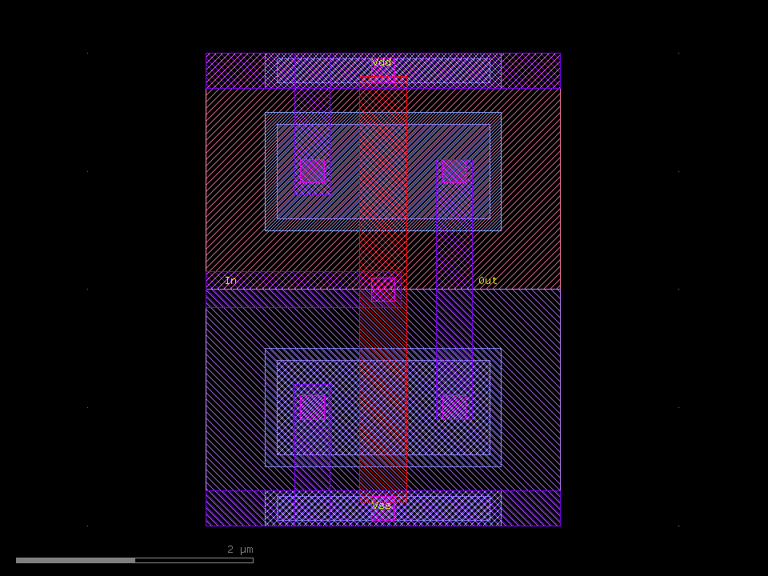
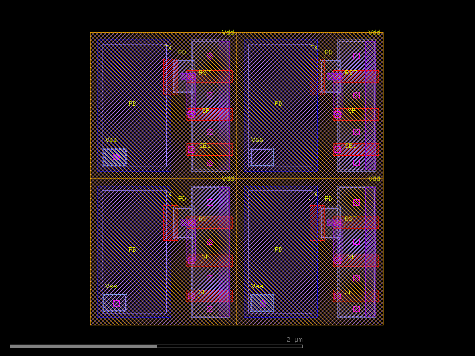

# Examples

Self-contained scripts live in [`examples/`](https://github.com/geniuskey/klayout-draw-mcp/tree/main/examples).
Each one builds a layout with the standalone `klayout.db` module and writes a GDS:

```bash
uv run python examples/cis_aps_pixel.py out.gds
```

You can also paste the body of a script's `build()` function into the `run_script`
tool. All examples share one layer map (OD `3/0`, POLY `6/0`, NPLUS `4/0`,
PPLUS `5/0`, METAL1 `9/0`, NWELL `1/0`, PWELL `2/0`, CONT `8/0`, TEXT `63/0`, …).

The screenshots below are rendered headlessly with `klayout.lay` by
[`scripts/render_examples.py`](https://github.com/geniuskey/klayout-draw-mcp/blob/main/scripts/render_examples.py),
the same way the documentation builds them in CI.

## Basic shapes

The four primitives — box, path, polygon and label — on a few layers. The place to
start if you just want to see geometry come out.

{ loading=lazy }

```python title="examples/basic_shapes.py"
--8<-- "examples/basic_shapes.py"
```

## NMOS transistor

A single planar n-channel MOSFET (W = 1 µm, L = 0.4 µm): active diffusion, a poly
gate crossing the channel, n+ source/drain implant, and contacts plus metal-1 pads
for source (S), gate (G) and drain (D).

{ loading=lazy }

```python title="examples/nmos_transistor.py"
--8<-- "examples/nmos_transistor.py"
```

## CMOS inverter

A pull-up PMOS (in an n-well, top) over a pull-down NMOS (in the p-well, bottom),
sharing one poly gate (the input, in red). The two drains are tied together on
metal-1 (the output). Vdd rails the top, Vss the bottom, with well ties on each.

{ loading=lazy }

```python title="examples/cmos_inverter.py"
--8<-- "examples/cmos_inverter.py"
```

## CIS APS pixel

A simplified 1 µm 4T CMOS image-sensor pixel: a large photodiode (PD), a transfer
gate (TX) to the floating diffusion (FD), and reset (RST), source-follower (SF) and
row-select (SEL) transistors in the shared active column. The unit pixel is drawn
into its own cell and instanced as a 2×2 array, the way a real sensor array repeats.

{ loading=lazy }

```python title="examples/cis_aps_pixel.py"
--8<-- "examples/cis_aps_pixel.py"
```
