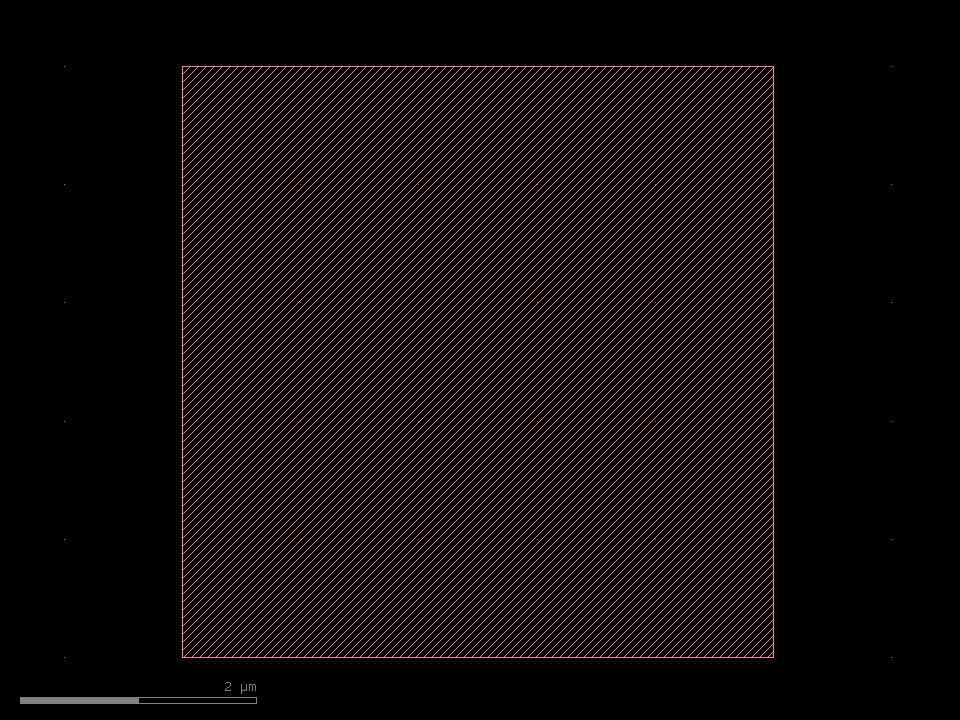
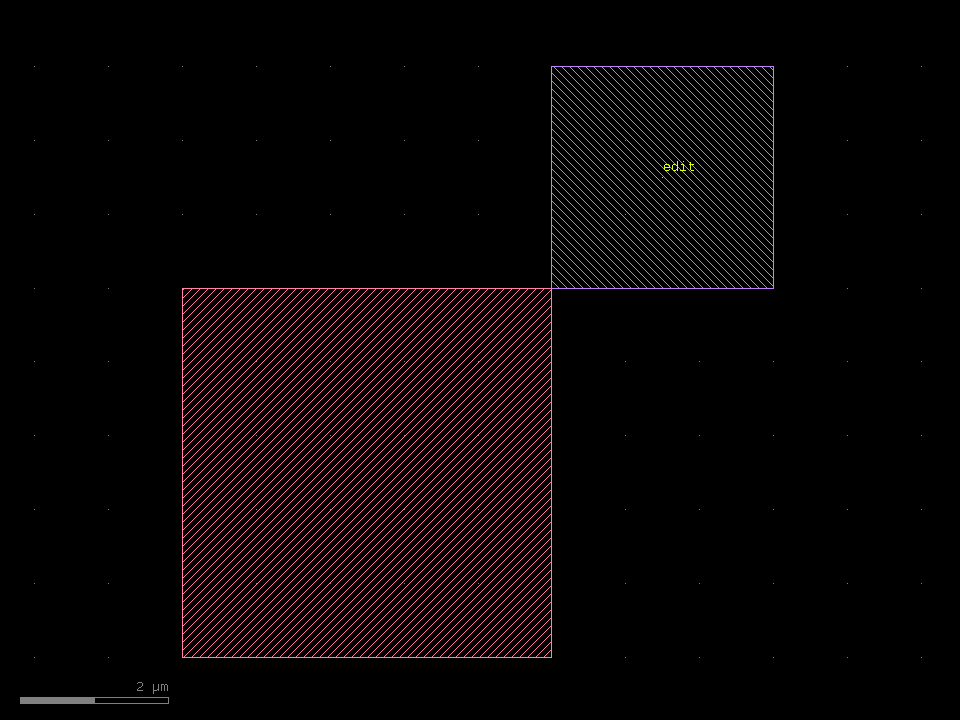

# Getting Started

This page walks through **everything klayout-draw-mcp can do**, as a sequence of prompts
you might type to an AI assistant (Claude Code or Claude Desktop) with the server
connected. Follow it top to bottom and you will have created, edited, inspected,
DRC-checked, and placed-and-routed a layout — the whole tool set on one page.

!!! note "Setup"
    `pip install klayout-draw-mcp`, then register it (see [Home](index.md#register-with-claude-code)).
    All coordinates are in **micrometers**; the default database grid is `dbu = 0.001` (1 nm).
    The screenshots are the actual rendered output of each step.

## 1. Your first shape

> "Draw a 5×5 µm box on layer 1, save it to out.gds and open it."

The assistant calls `new_layout()` → `add_box(1, 0, 0, 5, 5)` → `save_gds("out.gds", open_after=True)`.

{ loading=lazy width=460 }

## 2. Add to and edit a layout

> "Add a 3 µm box on layer 2 in the top-right corner and label it 'edit'."

`add_box(2, 5, 5, 8, 8)` → `add_label(63, 6.5, 6.5, "edit")` → `save_gds(...)`.

{ loading=lazy width=460 }

To edit a file from disk instead of the in-memory layout, start with
`load_gds("out.gds")` and keep adding shapes the same way.

## 3. Build a real cell

> "Draw a CMOS inverter: a PMOS over an NMOS sharing one poly gate, with Vdd/Vss rails."

The drawing tools handle the boxes; for anything more involved the assistant uses
`run_script` with the full `klayout.db` API.

{ loading=lazy width=420 }

See the [Examples](examples.md) gallery for the full source of this and other cells.

## 4. Hierarchy and arrays

> "Make a 1 µm 4T CIS image-sensor pixel and tile it as a 2×2 array."

`create_cell("PIXEL")` builds the unit cell, then `place_cell("PIXEL", …, nx=2, ny=2, dx=1, dy=1)`
tiles it — exactly how a sensor array repeats.

{ loading=lazy width=460 }

## 5. Open and inspect an existing GDS

> "Load chip.gds and tell me what's on each layer."

`load_gds("chip.gds")` → `inspect_gds()`:

```text
top_cell='CIS_APS', dbu=0.001 um, cells=2
bbox: (0,0;2,2) um
cells: ['APS_PIXEL', 'CIS_APS']

layer       shapes    area[um^2]   bbox[um]
2/0              4        4.0000   (0,0)-(2,2)
3/0             16        2.4192   (0.08,0.06)-(1.94,1.94)
6/0             16        0.3936   (0.5,0.16)-(1.97,1.82)
9/0             12        0.3200   (0.62,0.06)-(1.95,1.94)
10/0             4        1.8000   (0.05,0.05)-(1.55,1.95)
```

## 6. Design-rule checks

> "Check that M1 spacing is ≥ 0.15 µm and that OD never overlaps POLY, and report where."

`drc_check([...])` returns PASS/FAIL with violation locations:

```text
DRC: 2 rules, 2 failing
spacing 3/0 >= 0.15um: FAIL (8 violations)  at (0.550,0.692), (1.010,0.500), (1.820,1.000), ...
forbidden overlap 3/0 & 6/0: FAIL (20 regions, 0.2784 um^2)  at (0.820,0.200), (1.820,0.200), ...
```

Because each violation has a location, the assistant can move the offending shape and
re-run — a closed correction loop. See [Editing &amp; DRC](editing-and-drc.md).

## 7. Place and route

> "Place six cells in two rows and connect them with M1, routing around the cells."

`place_cell` lays the cells down; `add_wire` / `add_via` draw routes, and for automatic
obstacle-aware routing the assistant runs a maze router in `run_script`:

{ loading=lazy width=520 }

The full technique stack — row placement, vias, and the maze router — is in
[Placement &amp; Routing](place-and-route.md).

## Where to go next

- **[Examples](examples.md)** — full source for each layout above
- **[Editing &amp; DRC](editing-and-drc.md)** — loading, inspection and design-rule checks
- **[Placement &amp; Routing](place-and-route.md)** — the P&R building blocks and recipes
- **[Home](index.md)** — the complete tool reference
