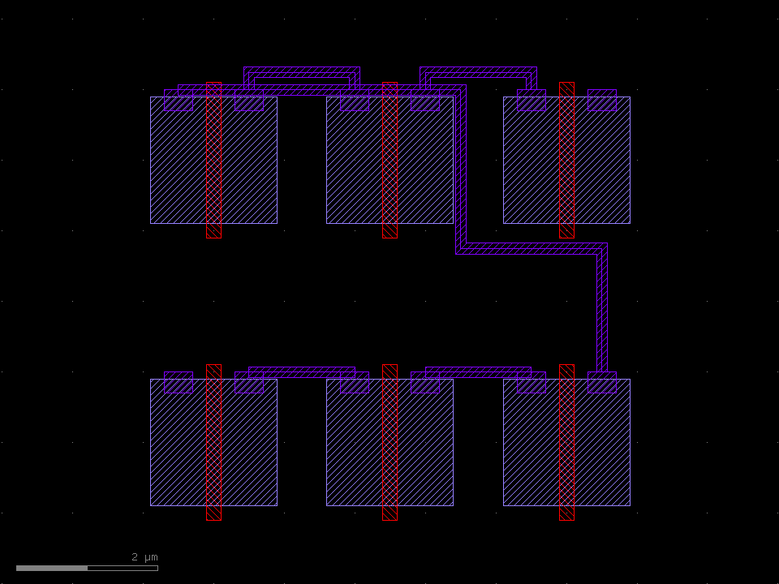

# Placement &amp; Routing

klayout-draw-mcp is **not** a P&R engine, but it provides the building blocks for one and
ships a skill of recipes so an assistant can place and route well. The division of labour:
**the assistant plans** the floorplan, net list and routing order; **the server realises
geometry and checks DRC**. The loop is *route → `drc_check` → fix → repeat*.

These tools were added in [0.1.2](changelog.md).

## Building-block tools

| Tool | Purpose |
| --- | --- |
| `create_cell(name)` | Create/select a cell as the active drawing target |
| `use_cell(name)` | Switch the active drawing cell (e.g. back to the top) |
| `place_cell(cell, x, y, orient, mag, nx, ny, dx, dy)` | Place an instance or `nx×ny` array of a cell |
| `add_via(x, y, bottom_layer, top_layer, cut_layer, …)` | Via: cut array + enclosing metal on two layers |
| `add_wire(layer, points, width)` | Manhattan wire — auto-inserts L-corners between points |

A typical multi-layer route by hand:

```text
create_cell("INV"); … add_box(...) …; use_cell("TOP")   # define + return
place_cell("INV", 0, 0, nx=3, ny=2, dx=1.5, dy=3.0)      # place a 3×2 block
add_wire(9, [[0.5, 2.0], [3.0, 2.0], [3.0, 5.0]], 0.2)   # M1, auto corner
add_via(3.0, 5.0, bottom_layer=9, top_layer=12, cut_layer=11, rows=2, cols=2)
add_wire(12, [[3.0, 5.0], [6.0, 5.0]], 0.3)              # M2
```

## Automatic routing (maze / Lee)

For many nets and obstacle avoidance, the assistant runs an obstacle-aware maze router in
`run_script`: it marks cell footprints and routed nets as blocked grid nodes, then finds a
shortest Manhattan path per net (with a turn penalty so routes stay straight). The demo
below places six cells in two rows and routes a five-net chain that weaves through the
routing channels between cells:

{ loading=lazy width=560 }

The router, placer and helpers live in the **`klayout-pnr` skill**
([`skills/klayout-pnr/`](https://github.com/geniuskey/klayout-draw-mcp/tree/main/skills/klayout-pnr)):

- `pnr_helpers.py` — layer map, `draw_box/draw_wire/draw_via`, `RoutingGrid`
- `placer.py` — `place_rows`, `power_rails`
- `maze_router.py` — `lee`, `route_net` (the algorithm above)
- `demo_pnr.py` — the end-to-end demo that produced the image (`uv run python skills/klayout-pnr/scripts/demo_pnr.py out.gds`)

The skill's `SKILL.md` documents the workflow and includes a self-contained router you can
paste straight into `run_script`. Install it with:

```bash
cp -r skills/klayout-pnr ~/.claude/skills/
```

## DRC in the loop

After routing, verify and iterate:

```text
drc_check([
  {"type": "spacing", "layer": 9, "min": 0.2},   # M1 spacing
  {"type": "width",   "layer": 9, "min": 0.1},   # M1 width
  {"type": "overlap", "layer": 9, "layer2": 6}   # M1 must not sit on POLY
])
```

Violation centres come back as coordinates, so the assistant can rip up and reroute the
offending nets — greedy routing means net order matters, so route congested/long nets first.
